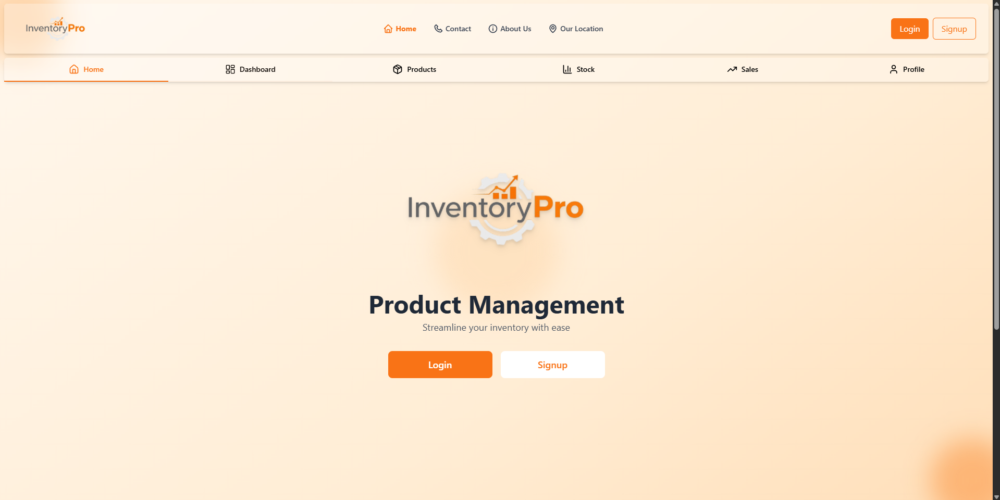
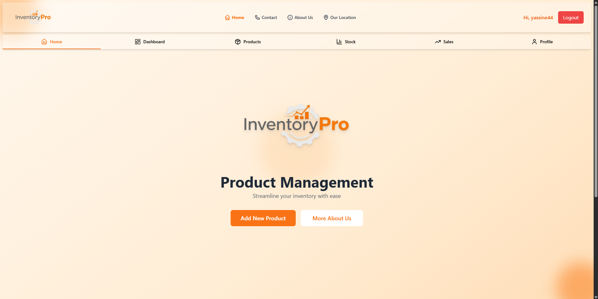
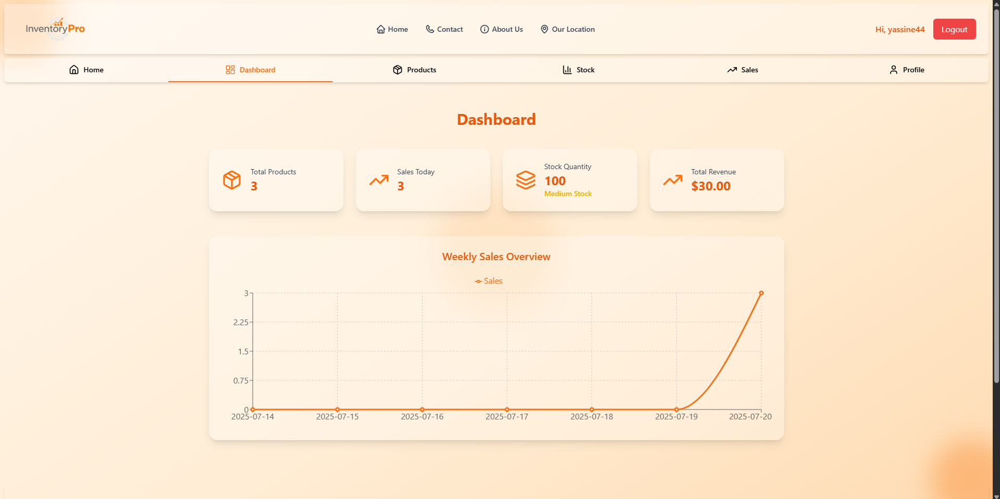
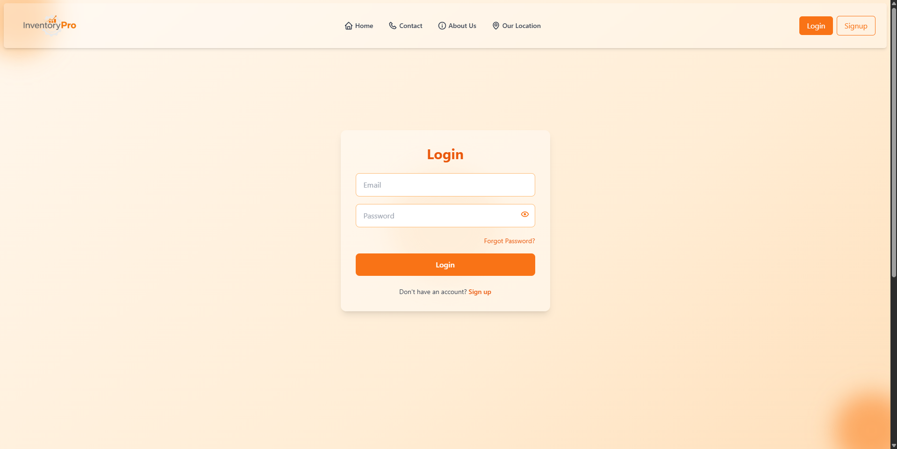
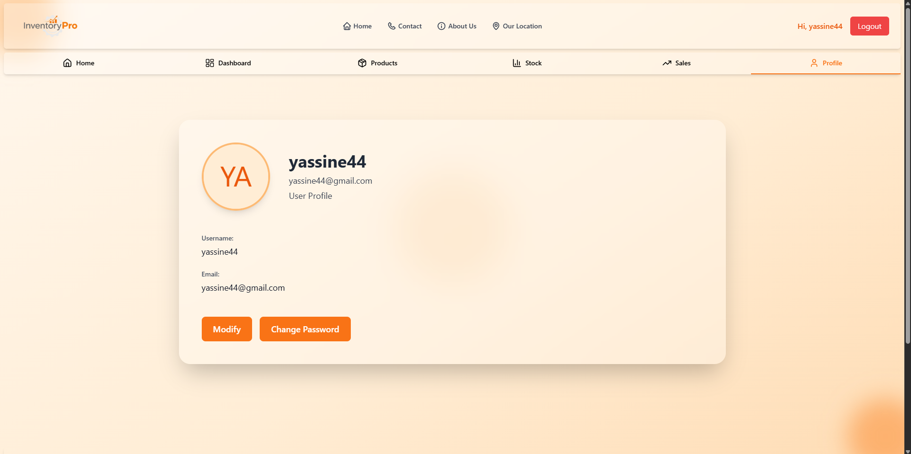

# InventoryPro Frontend

InventoryPro is a powerful web application to manage products, sales, and stock, with a visual dashboard for tracking activity.

## ❗ Important

- I had previously pushed this project, but due to some issues, I had to delete it and push it again.

## 🚀 Features

- Product Management
- Sales and Stock Tracking
- Real-Time Dashboard Charts
- Responsive UI built with React + Vite

## 🛠️ Tech Stack

- Frontend: React + Vite
- Backend: PHP (REST API)
- Database: MySQL (XAMPP)

## 📸 Screenshots










## 🎥 Video 
[Watch the full video](/public/video/Enregistrement%202025-07-20%20115713.mp4)

## 📦 Getting Started

### 1. Clone the Frontend

```bash
git clone https://github.com/BD-YASSINE/InventoryPro.git
cd InventoryPro
```

### 2. Install Dependencies

```bash
npm install vite  
```

### 3. Start the Development Server

```bash
npm run dev
```

Make sure the backend is running and `FRONTEND_URL` in the backend `.env` is set correctly to this frontend URL.

## 📄 License

See [LICENSE](/LICENSE)

## 👤 Author

Made by [**ERROR**](https://github.com/BD-YASSINE)

## 📞 Contact
linkedin: [My LinkedIn](https://www.linkedin.com/in/yassine-badri-0279a7342/)

---

© 2025 InventoryPro. All rights reserved.
